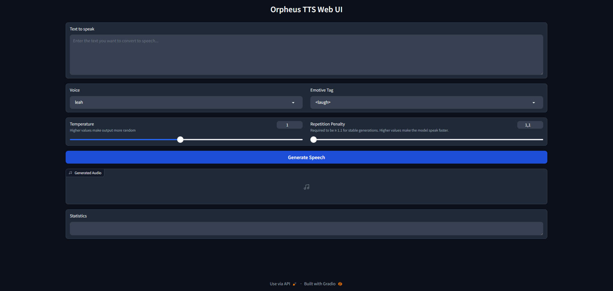

# Orpheus TTS Web UI

A simple web user interface for Orpheus Human-Like Text-to-Speech.



## Installation

1. Clone this repository

```bash
git clone https://github.com/vpakarinen/orpheus-tts-webui.git

cd orpheus-tts-webui
```

2. Create and activate virtual environment:

```bash
python -m venv orpheus-env

# Windows
.\orpheus-env\Scripts\activate

# Linux/macOS
source orpheus-env/bin/activate
```

3. Install the required packages:

```bash
pip install -r requirements.txt
```

4. Run the application:

```bash
python app.py
```

## Hugging Face Login

To get your Hugging Face token:
- Go to [Hugging Face](https://huggingface.co/settings/tokens)
- Sign in or create an account
- Create a new token (read access is sufficient)

After that login with your token:

```bash
pip install huggingface_hub

from huggingface_hub import login
login()
```

## Required Files

The application will automatically download the following files if they don't exist

- Orpheus TTS model files (~6.5GB)

## Sponsor

If you find this project useful, consider supporting me:

[](https://www.buymeacoffee.com/vpakarinen)

[](https://ko-fi.com/vpakarinen)

## Credits

This project uses the [orpheus-tts](https://github.com/canopyai/Orpheus-TTS) library for text-to-speech functionality.

## Author

vpakarinen (https://github.com/vpakarinen)
